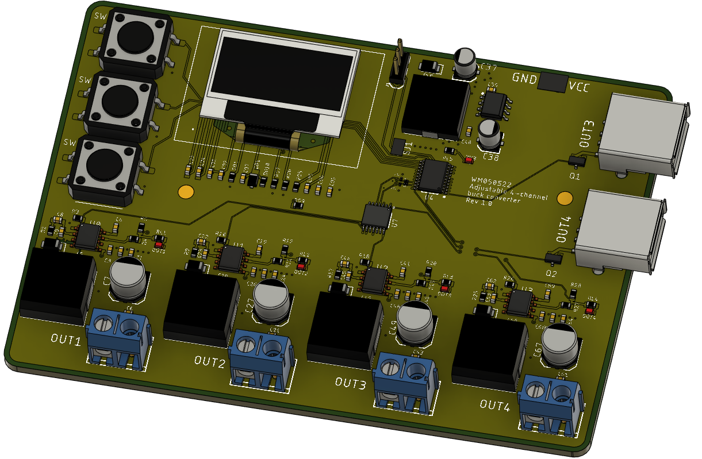

# Zasilacz_impulsowy_4_kanały

Wykorzystanie mikrokontrolera STM8, wyświetlacza Oled oraz 3 przycisków sterujących umożliwia ustawienie wartości napięcia na każdym z wyjść czterech przetwornic TPS54321 niezależnie. Dodatkowo 3 i 4 kanał został wykorzystany do zasilenia porów USB A, które spełniają funkcję ładowania urządzeń zewnętrznych.
Poniższe wartości dotyczą pojedyńczego kanału:
Zakres napięcia wyjściowego od 3.3V do 12V
Maksymalny prąd przy nastawie napięcia wyjściowego 12V = 2A

Link do podglądu w 3D: https://a360.co/3L5ZWJz

Poprawka layoutu elementów 27.05.2022.

Wprowadzono optymalizacje położenia obwodów przetwornic, dzieki czemu szerokość płytki zmniejszyła się ze 112mm do 98mm. 
Głównym powodem powyższej zmiany było złe ułożenie elementów takich jak dławik, dioda oraz kondensatory na wyjściu każdej przetornicy. Poniższe zdjęcie przedstawia powierzchnie (zaznaczone kolorem zielonym) switching node, która docelowo (strona lewa) została możliwie maksymalnie zmniejszona.

Projekt cały czas w rozwoju.
